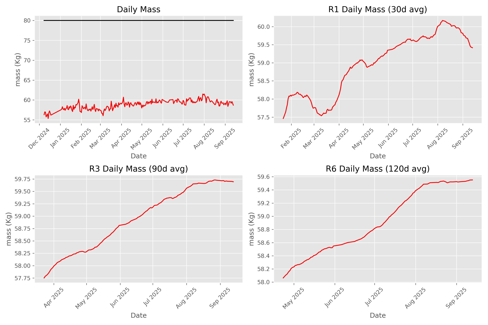
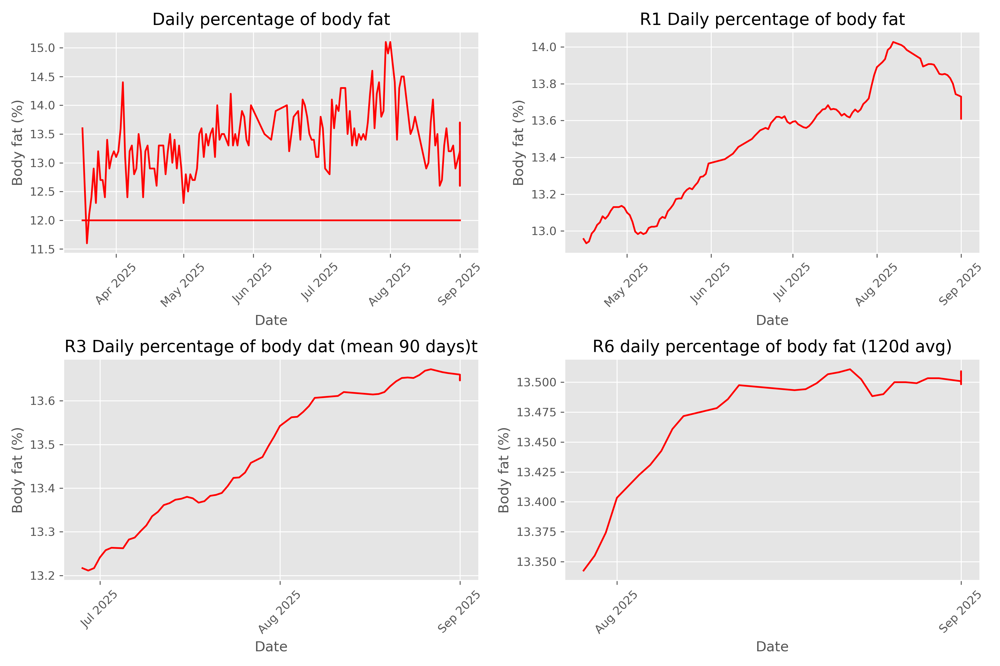
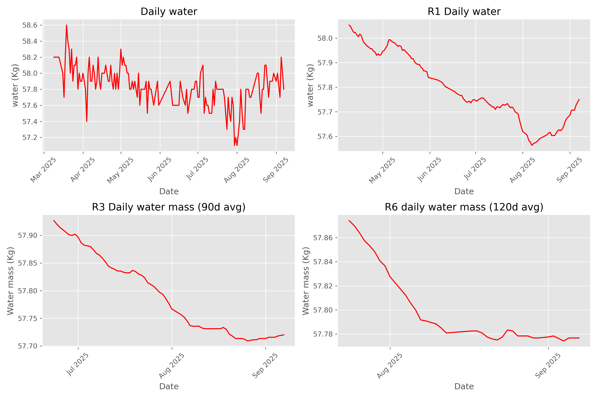
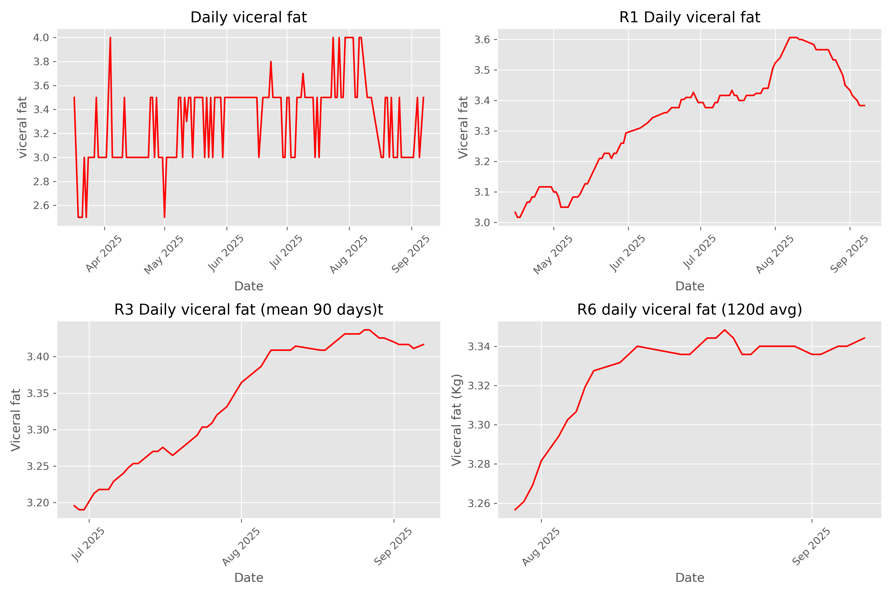

# health
health metrics

**this metrics are colected at morning before beak-fast and using bioimpedance**

### Body mass vision

### Body fat vision

### Muscular mass vision

### protein at body vision

### body water mass

### Viceral fat

